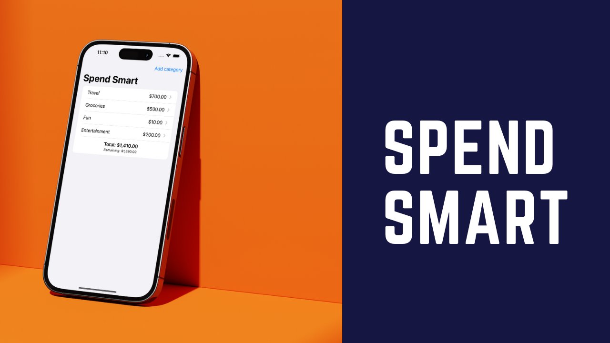

Spend Smart is an app implemented in SwiftUI and SwiftData. The app keeps tracks of your budget categories and expenses. The main purpose of the app is to show, how to implement SwiftData apps. The implementation also covers few unit tests and end-to-end tests. 

> If you are interested in learning more about SwiftData then check out course [SwiftData - Declarative Data Persistence for SwiftUI](https://www.udemy.com/course/swiftdata-declarative-data-persistence-for-swiftui/?referralCode=A1303D0BA99171C90D9B)

Twitter: @azamsharp 